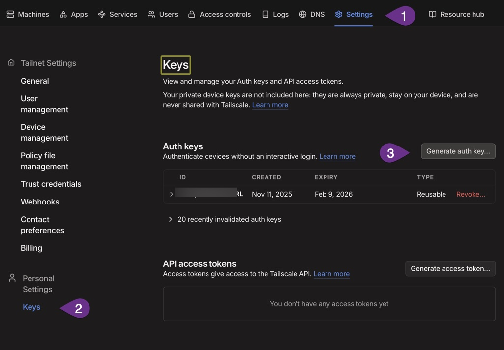
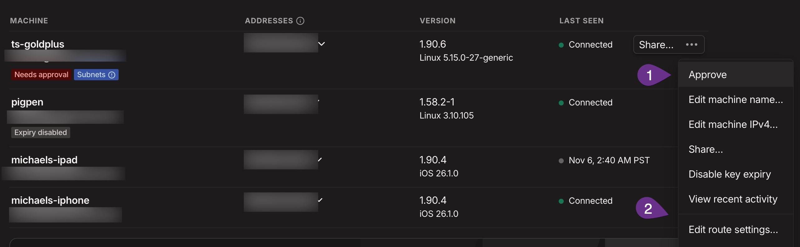
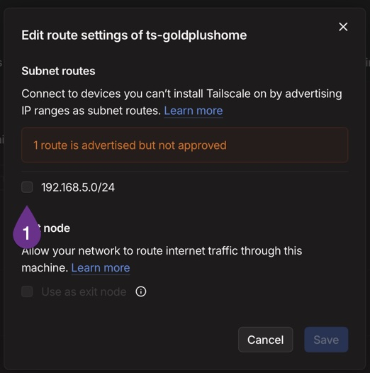
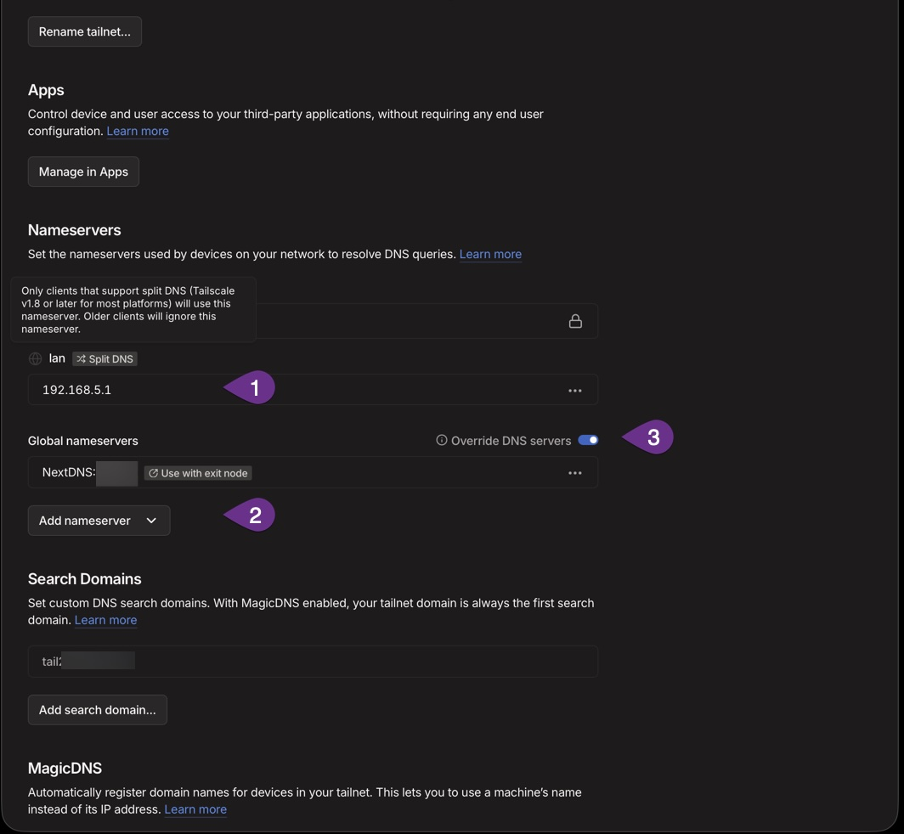
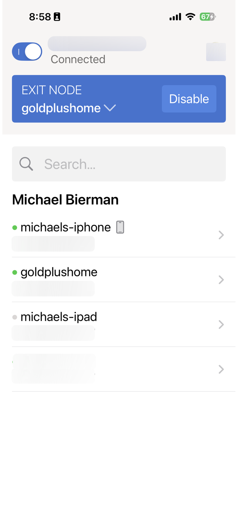
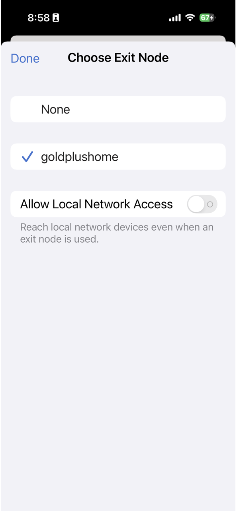

<h1 align="center">
 🔥 Firewalla Tailscale Integration via Docker 🐳
</h1><br><br>
<p1 align="center">Easily install and manage Tailscale on your Firewalla which gives you access your Firewalla networks when you are away. You can also use it like a VPN Server to route all internet traffic through your Firewalal network.</p1>
<br><p align="center">
  <a href="#-why-use-this">Why?</a> •
  <a href="#-features">Features</a> •
  <a href="#-preparation">Preparation</a> •
  <a href="#-installation">Installation</a> •
  <a href="#-uninstallation">Uninstallation</a> •
  <a href="#-how-it-works">How It Works</a> •
  <a href="#-license">License</a>
</p>

---
## ❓ Why Use This?

Firewalla already provides an excellent, no-subscription [VPN Server](https://help.firewalla.com/hc/en-us/articles/115004274633-Firewalla-VPN-Server) and [VPN Client](https://help.firewalla.com/hc/en-us/articles/360023379953-VPN-Client). So, why add Tailscale?

Tailscale excels where traditional VPNs can be challenging. Many ISPs now place users behind Carrier-Grade NAT (CGNAT), making it difficult or impossible to get a stable public IP address, which is often required for a standard VPN server. Tailscale navigates CGNAT effortlessly, creating a secure, peer-to-peer mesh network that "just works."


**Key benefits include:**
*   **No Public IP Required:** Connect to your home network from anywhere, even if your ISP uses CGNAT.
*   **Unified Network:** All your devices (laptops, phones, servers) join networks securely. No need to configure different VPN clients or settings for each one.
*   **Simplified Access:** Once a device is on your Tailscale network (your "tailnet"), it can securely connect to any other authorized device with consistent and simple access rules.
*   **Support for Exit node:** With Exit node enabled, you have the option of a "full-tunnel" a VPN with all traffic going through your Firewalla or a split tunnel where only traffic to your Firewalla networks goes through Tailscale. If you disbale Exit node, all other traffic goes to your internet connection. This is the same as Firewalla's default VPN Server. If you enable Exit node On the firewalla you can still chose on the fly in the [Tailscale app](https://github.com/mbierman/firewalla-tailscale-docker/blob/main/README.md#exit-node).


**Bottom line:** Tailscale provides a unified, always-on private network that simplifies remote access, especially for users without a stable public IP. This installer makes it easy to get it running on your Firewalla.

Tailscale offers a generous [free tier](https://tailscale.com/pricing) for personal use.

## ✨ Features

*   **Interactive Installation:** A guided setup process that makes configuration easy.
*   **Automated Subnet Detection:** The script automatically detects your local subnets (LAN and VLANs) and asks which ones you want to make accessible through Tailscale.
*   **Simple Exit Node Setup:** A simple yes/no prompt to configure your Firewalla as an exit node. Exit Node is enabled by default. 
*   **Optional IPv6 Support:** Choose whether to enable IPv6 forwarding for your Tailscale node.
*   **Persistent Operation:** Installs a start script (`/home/pi/.firewalla/config/post_main.d/tailscale-start.sh`) that ensures Tailscale automatically starts after reboots and Firewalla updates.
*   **Clean Uninstallation:** A separate script to remove all traces of the Tailscale Docker setup.
*   **Minimal Impact:** Designed to integrate seamlessly with Firewalla's existing Docker environment without interference.

## 📝 Preparation

Before you begin, you will need:
*   A [Firewalla](https://firewalla.com) device (tested on Gold and Purple series).
*   SSH access to your Firewalla. You can find instructions [here](https://help.firewalla.com/hc/en-us/articles/115004397274-How-to-access-Firewalla-using-SSH).
*   A [Tailscale account](https://login.tailscale.com/start).

## 🚀 Installation

The installation process involves three main stages: **getting a Tailscale auth key**, **running the installer script**, and **configuring your new node** in the Tailscale admin console.

### Step 1: Get Your Tailscale Auth Key

1.  Open your Tailscale admin console and go to **Settings** > **Keys**.
2.  Click **Generate auth key...**.

    

3.  Configure the key:
    *   Give it a descriptive name (e.g., "firewalla-key").
    *   Make sure **Reusable** is selected.
    *   It's recommended to set an expiration date for the key for security.
    *   Click **Generate key**.

    

4.  **Copy the generated key immediately.** You will not be able to see it again.

### Step 2: Run the Installer

SSH into your Firewalla and run the following command. The script is interactive and will guide you through the setup.

```bash
curl -sSL "https://raw.githubusercontent.com/mbierman/firewalla-tailscale-docker/main/install.sh?t=$(date +%s)" | sudo bash
```

You will be prompted for the following information:
1.  **Hostname:** A name for your Firewalla on the Tailscale network (e.g., `ts-firewalla`).
2.  **Tailscale Auth Key:** Paste the key you generated in the previous step.
3.  **Exit Node:** Choose `y` if you want to route all Internet traffic through your Firewalla when you are away from home.
4.  **IPv6 Forwarding:** Choose `y` if you want to enable IPv6 forwarding for your Tailscale node. (Default: `n`)
5.  **Advertise Subnets:** The script will detect your local networks. Choose `y` for any LANs or VLANs you want to access from your other Tailscale devices.

The script will then create the necessary files, pull the Docker container, and start Tailscale. There is also a start script that will run if your firewalla reboots.

### Step 3: Configure in Tailscale Admin Console

After the script finishes, you must authorize the new device and its routes.

1.  **Authorize the Device:** Go to the [Machines page](https://login.tailscale.com/admin/machines) in your Tailscale console. Your new Firewalla device should appear. Click the **Approve** button.

    

2.  **Enable Subnet Routes:** Click the `...` menu next to your new device and select **Edit route settings...**. Approve any subnets you chose to advertise during installation.

    

3.  **Enable Exit Node (Optional):** If you configured the device as an exit node, you must also enable it in the **Edit route settings...** panel.

4.  **Configure DNS (Recommended):** To resolve local hostnames, go to the [DNS page](https://login.tailscale.com/admin/dns) in your Tailscale console.
    *   Add a new **Nameserver**.
    *   Set the IP address to your Firewalla's LAN IP (e.g., `192.168.x.1`).
    *   Enable **Restrict to search domain** and add the subnets you are advertising.
    *   Enable **Override local DNS**.

    

Your Firewalla is now a fully functional part of your Tailnet!

### Advanced Installation

The `install.sh` script supports flags for more controlled execution:
*   **Test Mode (`-t`):** A "dry run" that shows what the script will do without making changes.
*   **Confirm Mode (`-c`):** Prompts for approval before executing each command.

To use them, append the flag to the end of the installation command:
```bash
# Test Mode Example
curl -sSL "https://raw.githubusercontent.com/mbierman/firewalla-tailscale-docker/main/install.sh?t=$(date +%s)" | sudo bash -s -- -t
```

## 🗑️ Uninstallation

To completely remove this Tailscale setup from your Firewalla, SSH in and run the following command:

```bash
sudo /data/tailscale-uninstall.sh
```

⛔️ This will stop and remove the container, delete all configuration files and directories created by the installer, and remove the uninstaller script itself.

## 📱Exit Node
If you use the default configured for exit node, you will be able to enable or disable the "full tunnel" on the client meaning you can decide if internet traffic goes over your Firewalla or not when you are connected to Tailscale. 

You can also use at as a VPN without access to your local Firewalla networks! 

<p align="center">
  
  
</p>

## 💡 How It Works

This project automates the process described in the [official Tailscale documentation for running in Docker](https://tailscale.com/kb/1282/docker). The installer script interactively helps you build the correct `--advertise-routes` and `--advertise-exit-node` arguments and other fun stuff for your setup and creates a persistent startup script so the container survives reboots.

## 📚 References

*   [Tailscale: How to run Tailscale in Docker](https://tailscale.com/kb/1282/docker)
*   [Tailscale: Subnet routers and traffic relay nodes](https://tailscale.com/kb/1019/subnets)
*   [Reddit: Easy Tailscale integration via docker compose](https://www.reddit.com/r/firewalla/comments/1mlrtvi/easy_tailscale_integration_via_docker_compose/) (Credit to u/adrianmihalko for the original concept)

## 📄 License

This project is licensed under the GNU General Public License v3.0 - see the [LICENSE](LICENSE) file for details.

---
<p align="center">
  Made with 🔥 and ❤️ for the Firewalla Community!
  <br>
  <em>Not associated with or supported by Firewalla Inc.</em>
</p>
